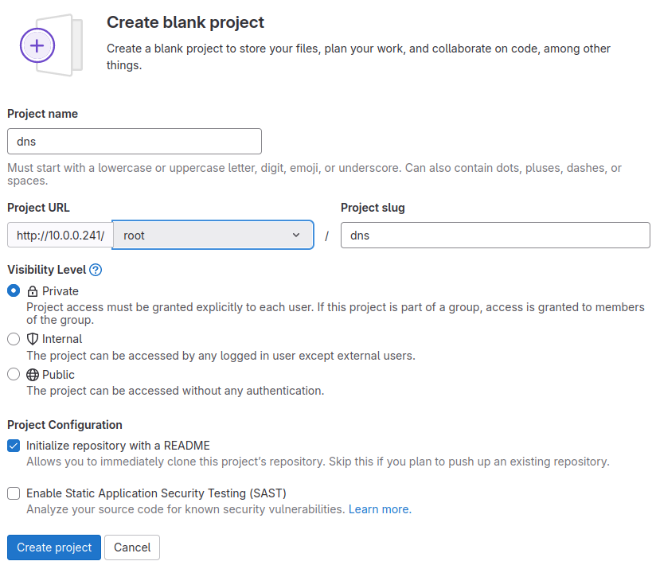
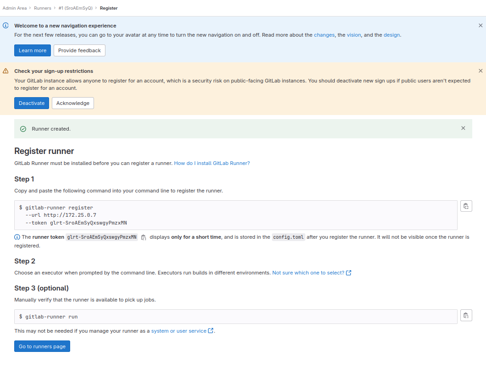
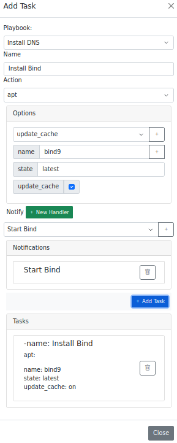
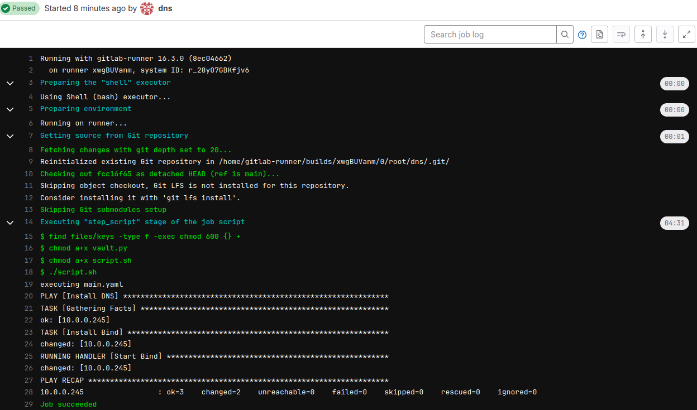

# Instalação de um serviço DNS

## Requisitos
*  Ubuntu 22.04.4
*  Python 3.11
*  Containernet 2.3.1b1

## Instalação dos requisitos

Instalando o Python:

```shell
sudo apt install python3.11
```

Instalando o containernet

```shell
$ git clone https://github.com/ramonfontes/containernet.git
$ cd containernet
$ sudo util/install.sh -W
```

## Iniciando simulação no ContainerNet

Para reproduzir o ambiente basta executar o seguinte comando nessa pasta:

```shell
sudo python3 dns_containernet.py
```
Com isso será instanciada a seguinte topologia:


Após a execução do código o prompt do ContainerNet será aprensentado,

Vamos abrir um terminal do container do Apache executando o comando `xterm cliente`,

com o terminal aberto vamos executar o comando `firefox`,


Após a iniciação dos containers, que pode demorar um pouco, vamos acessar o Gitlab no endereço: [http://10.0.0.241](http://10.0.0.241) (atualize a pagina a cada 10s para ver se iniciou)
e utilizar as seguintes credenciais:
*  Usuario: root
*    Senha: doo$654321


O próximo passo é criar um projeto no Gitlab, o nome do projeto será **dns**



O próximo passo é criar um access token, no caminho [Projeto Webserver > Settings > Access Tokens](http://10.0.0.241/root/dns/-/settings/access_tokens)
será utilizado as seguintes informações:
*   Token Name: dns
*   Expiration date: vazio
*   Select a role: Maintainer
*   Select scopes: marcar todos

Obs: Lembrar de copiar o token e salvar.


O próximo passe é criar um Gitlab Runner no caminho [Admin Area > CI/CD > Runners](http://10.0.0.241/admin/runners)

Clicar no botão **New instance runner**
marcar a opção **Run untagged jobs**


Na próxima tela copiar o Token;



vamos abrir um terminal do container do runner, executando o comando `xterm runner` no prompt do ContainerNet,

com o terminal do runner aberto, execute o seguinte comando para registrar o Runner no Gitlab, substituir "__TOKEN__" pelo token gerado anteriormente:

```shell
gitlab-runner register --non-interactive --url http://10.0.0.241 --executor shell --token __TOKEN__ 
```


Verificar se o Runner esta online,


O próximo passo é acessar o DevOpsOrchestrator (DOO) em uma nova aba, no endereço: [http://10.0.0.243:8000](http://10.0.0.243:8000)
utilizar as seguintes credenciais:
*  Login: admin
*  Senha: admin


Clicar no menu [Repositorio](http://10.0.0.243:8000/repository/repo/)
clicar no botão **Adicionar**
utilizar as seguintes informações:

*  Nome: dns
*  URL: http://10.0.0.241/root/dns.git
*  Token: dns
*  Token Key: __Access Token Gerado anteriormente__

Na próxima tela clicar no botão **IaC**,


O próximo passo é adicionar um inventario, clicando no botão **Add Host**,
vamos preencher com as seguintes informações:
* Host: 10.0.0.245
* Variables:
  *  ansible_user e clicar em "Adicionar";
  *  ansible_password e clicar em "Adicionar";
  *  ansible_become e clicar em "Adicionar";
  *  ansible_become_password e clicar em "Adicionar";
  *  ansible_ssh_common_args e clicar em "Adicionar";
  *  ansible_become_method e clicar em "Adicionar";
* ansible_user: ubuntu
* ansible_password: ubuntu
* ansible_become: true
* ansible_become_password: ubuntu
* ansible_ssh_common_args: -o StrictHostKeyChecking=no
* ansible_become_method: su

O próximo passo é adicionar o arquivo de configuração clicando no botão **Add File**,
preencher com as seguintes informações:
* Filename: main
* Name: Install DNS e clicar em "Adicionar"


O próximo passo é clicar em **add Hosts** para associar o host a configuração,
selecione o IP 10.0.0.254,


O próximo passo é clicar em **add Task**,
preencher com as seguintes informações:
* Playbook: Install Bind
* Name: install bind9
* Action: apt
* Option:
  * name e clicar em "+";
  * state e clicar em "+";
  * update_cache e clicar em "+";
preencher:
* name: bind9
* state: latest
* update_cache: checked

O próximo passo é clicar em **New Handler**
preencher com as seguintes informações:
    Name: start bind
* Action: sysvinit
* Options:
  * state e clicar em "+"
*  name: named
*  state: started


Selecionar **start bind** em Notify e clicar em "+",



Clicar me **Add Task**
Clicar em **Close**

Entrar no Gitlab e ver a execução do pipeline no caminho [Projeto webserver > Build > Pipelines ](http://10.0.0.241/root/webserver/-/pipelines)


Entrar no pipeline e ver o script que foi executado,



Antes de criar um novo template vamos adicionar um serviço no Catalogo, clicando em [Catalogo](http://10.0.0.243:8000/doo/catalog/) no menu superior,

Nessa tela vamos clica em **+ Team** para adicionar uma nova equipe,

* Equipe: Redes e clicar em "Salvar";

Na tela de Catalogo vamos adicionar um grupo na equipe de Redes, clicando em **+ Group**

* Grupo: Infraestrutura
* Equipe: Redes e clicar em "Salvar";

Na tela de Catalogo vamos adicionar um serviço no grupo de Infraestrutura, clicando em **+ Service**

* Serviço: DNS
* Status: Ativo
* Grupo: Infraestrutura e clicar em "Salvar";

O catalogo ficará com a seguinte estrutura:


O próximo passo é criar o template que adicionará uma nova zona, clicando em [Repositorio](http://10.0.0.243:8000/repository/repo/) e clicando em "IaC" no repositório DNS, na próxima tela clicar em **Add Template**, preenche com os seguintes dados:

* Name: Add Zona
* Filename: add_zona
* Service: DNS

Na tela de IaC vamos clicar em **Add Hosts** no template Add Zona e selecionar o host 10.0.0.254 e clicar em "Add";

Na tela de IaC vamos clicar em **Add Task** no template Add Zona, aqui vamos adicionar as tarefas que irão adicionar a zona,
A primeira tarefa vai adicionar uma zona no  arquivo named.conf, para isso vamos selecionar a action "blockinfile" e em options vamos preencher com as seguintes informações:

* Name: Adicionar zona no named.conf
* Action: blockinfile
* Option:
  * block e clicar em "+"
  * marker e clicar em "+"
preencher:
* block:
  
```bind
zone "{{zona}}" IN {
  type master;
  file "/var/lib/bind/{{zona}}";
};
```

* marker: #{mark} {{zona}}
* path: /etc/bind/named.conf

Obs: a variavel {{zona}} permite que seu valor seja definido no formulario de provisionamento, então toda variavel entre chaves duplas terá um campo no formulario de provisionamento.

Clicar em "+ Add Task"

A segunda tarefa tem como objetivo criar um arquivo de zona, iremos utilizar a action "copy", para isso vamos subir no formulario e substituir os valores com as seguintes informações:

* Name: Copiar arquivo de zona
* Action: copy
* Option:
  * content e clicar em "+"
  * group e clicar em "+"
  * mode e clicar em "+"
  * owner e clicar em "+"
preencher:
* content:
  
```bind
$TTL 10800
{{zona}}. IN  SOA localhost. root.localhost. (
123         ; Serial (YYYYMMDDnn)
28800       ; Refresh
7200        ; Retry
604800      ; Expire
86400      ; Minimum TTL
)
 IN NS localhost.
www     IN      A       10.0.0.244
```

* dest: /var/lib/bind/{{zona}}
* group: bind
* mode: 0644
* owner: bind

Obs: é criado um arquivo de zona default já com um registro do tipo A apontando para o IP 10.0.0.244

Clicar em "+ Add Task"

Por último vamos adicionar a tarefa que irá carregar a zona no servidor, vamos usar a action "shell", para isso vamos subir no formulario e substituir os valores com as seguintes informações:

* Name: Carregar zona no servidor
* Action: shell
* Option:
  * cmd e clicar em "+"
preencher:
* cmd: rndc reconfig {{zona}}

Clicar em "+ Add Task"

Com as três tarefas criados podemos clicar em "close".


Vamos criar uma solicitação de mudança, acessando a opção [solicitações](http://10.0.0.243:8000/doo/ticket/) no menu superior, clicando no botão "adicionar" e preenchendo com as seguintes informações:

*  Numero: 123
*  Titulo: Adicionar Zona
*  Descrição: Solicito que seja adicionado a zona teste.zona.br
*  Prioridade: media

Clicar em "Salvar"


Com a solicitação criada podemos clicar no botão **provision**, na tela de provisão vamos preencher com as seguintes informações:

* Services: DNS
* Templates: Add Zona
* zona: teste.zona.br

antes de clicar em "provisionar" vamos fazer o seguinte teste, no console do containernet vamos digitar o comando ``` xterm cliente ``` para chamar um terminal do cliente,
nesse terminal vamos instalar o pacote dnsutils com o seguinte comando:
```shell
apt update && apt install dnsutils
```
Depois de instalado vamos executar o seguinte comando:

```shell
dig @10.0.0.245 teste.zona.br SOA +short
```
que não deve retornar nada por que a zona não existe,

vamos voltar para o DOO e clicar em **provision**

será mostrado o resultado do provisionamento como podemos ver abaixo:


vamos voltar para o terminal do cliente e executa novamento o comando:

```shell
dig @10.0.0.245 teste.zona.br SOA +short
```
Que agora deve retornar informações do SOA, indicando que a zona foi criada, como podemos ver abaixo:

```shell
root@cliente:/home/ubuntu#  dig @10.0.0.245 teste.zona.br SOA +short
localhost. root.localhost. 123 28800 7200 604800 86400
```
Dessa forma sempre que precisar criar uma zona basta utilizar o template e realizar um provisionamento.

## Video Explicativo

[](https://www.youtube.com/watch?v=8h7ShyqaLUg)


  


