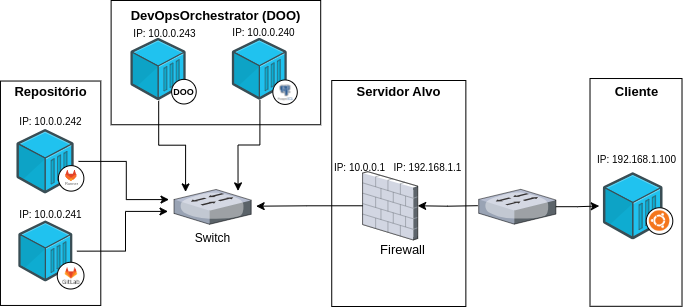
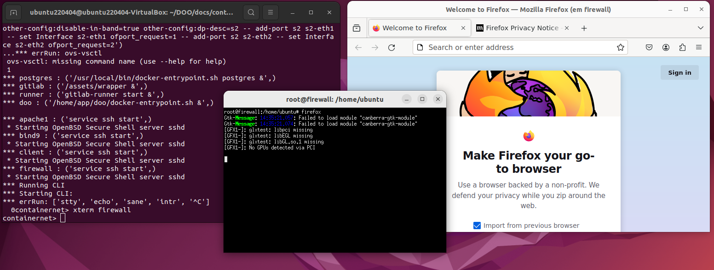
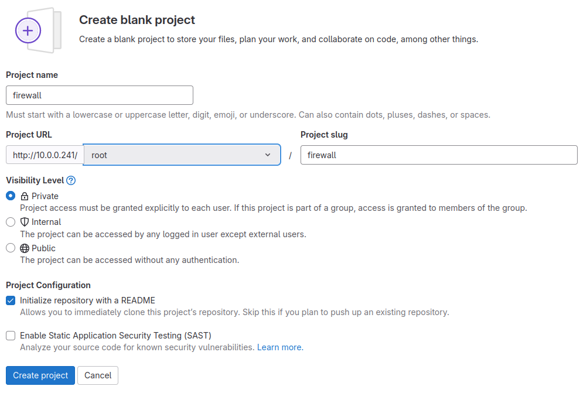
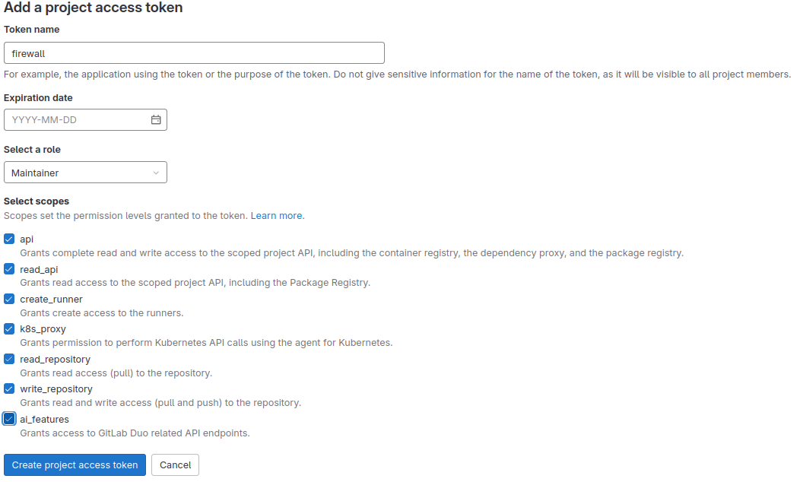
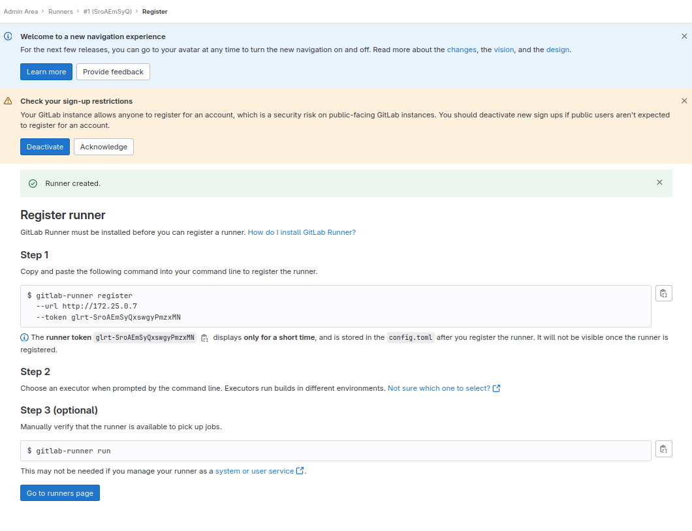
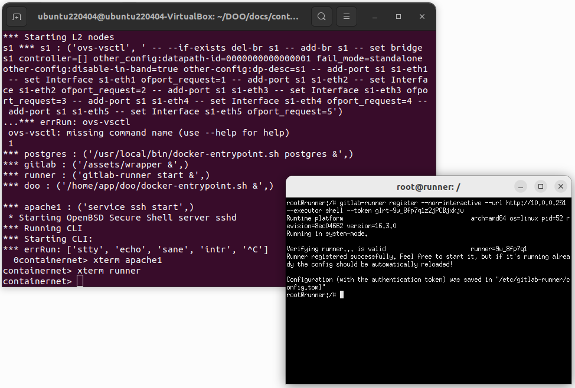
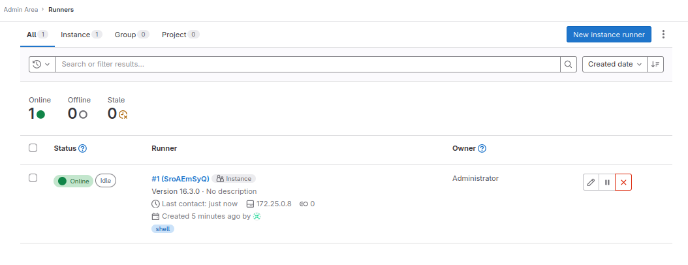
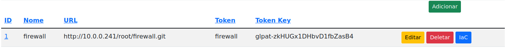
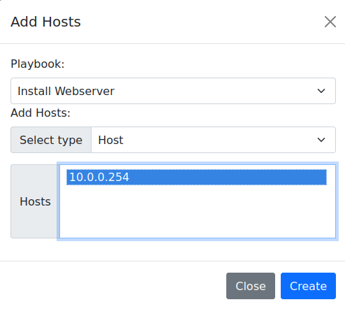

# Instalação de um webserver

## Requisitos
*  Ubuntu 22.04.4
*  Python 3.11
*  Containernet 2.3.1b1

## Instalação dos requisitos

Instalando o Python:

```shell
sudo apt install python3.11
```

Instalando o containernet

```shell
$ git clone https://github.com/ramonfontes/containernet.git
$ cd containernet
$ sudo util/install.sh -W
```

## Iniciando simulação no ContainerNet

Para reproduzir o ambiente basta executar o seguinte comando nessa pasta:

```shell
sudo python3 firewall_containernet.py
```
Com isso será instanciada a seguinte topologia:



Após a execução do código o prompt do ContainerNet será aprensentado,

Vamos abrir um terminal do container do Apache executando o comando `xterm firewall`,

com o terminal aberto vamos executar o comando `firefox`,




Após a iniciação dos containers, que pode demorar um pouco, vamos acessar o Gitlab no endereço: [http://10.0.0.241](http://10.0.0.241) (atualize a pagina a cada 10s para ver se iniciou)
e utilizar as seguintes credenciais:
*  Usuario: root
*    Senha: doo$654321


O próximo passo é criar um projeto no Gitlab, o nome do projeto será **firewall**



O próximo passo é criar um access token, no caminho [Projeto Webserver > Settings > Access Tokens](http://10.0.0.241/root/webserver/-/settings/access_tokens)
será utilizado as seguintes informações:
*   Token Name: firewall
*   Expiration date: vazio
*   Select a role: Maintainer
*   Select scopes: marcar todos

Obs: Lembrar de copiar o token e salvar.



O próximo passe é criar um Gitlab Runner no caminho [Admin Area > CI/CD > Runners](http://10.0.0.241/admin/runners)

Clicar no botão **New instance runner**
marcar a opção **Run untagged jobs**


Na próxima tela copiar o Token;



vamos abrir um terminal do container do runner, executando o comando `xterm runner` no prompt do ContainerNet,

com o terminal do runner aberto, execute o seguinte comando para registrar o Runner no Gitlab, substituir "__TOKEN__" pelo token gerado anteriormente:

```shell
gitlab-runner register --non-interactive --url http://10.0.0.251 --executor shell --token __TOKEN__ 
```



Verificar se o Runner esta online,



O próximo passo é acessar o DevOpsOrchestrator (DOO) em uma nova aba, no endereço: [http://10.0.0.243:8000](http://10.0.0.243:8000)
utilizar as seguintes credenciais:
*  Login: admin
*  Senha: admin


Clicar no menu [Repositorio](http://10.0.0.243:8000/repository/repo/)
clicar no botão **Adicionar**
utilizar as seguintes informações:

*  Nome: firewall
*  URL: http://10.0.0.241/root/firewall.git
*  Token: firewall
*  Token Key: __Access Token Gerado anteriormente__

Na próxima tela clicar no botão **IaC**,



O próximo passo é adicionar um inventario, clicando no botão **Add Host**,
vamos preencher com as seguintes informações:
* Host: 10.0.0.1
* Variables:
  *  ansible_user e clicar em "Adicionar";
  *  ansible_password e clicar em "Adicionar";
  *  ansible_become e clicar em "Adicionar";
  *  ansible_become_password e clicar em "Adicionar";
  *  ansible_ssh_common_args e clicar em "Adicionar";
  *  ansible_become_method e clicar em "Adicionar";
* ansible_user: ubuntu
* ansible_password: ubuntu
* ansible_become: true
* ansible_become_password: ubuntu
* ansible_ssh_common_args: -o StrictHostKeyChecking=no
* ansible_become_method: su

O próximo passo é adicionar o arquivo de configuração clicando no botão **Add File**,
preencher com as seguintes informações:
* Filename: main
* Name: Config Firewall e clicar em "Adicionar"


O próximo passo é clicar em **add Hosts** para associar o host a configuração,
selecione o IP 10.0.0.1,



O próximo passo é clicar em **add Task**,
preencher com as seguintes informações:
*  Playbook: Config Firewall
*  Name: Ativar o encaminhamento de IP
*  Action: lineinfile
*  Option:
  *  line e clicar em "+"
preencher:
* line: net.ipv4.ip_forward=1
* path: /etc/sysctl.conf
  
Clicar me **+ Add Task**

O próximo passo é subir a tela e substituir os campos,
com as seguintes informações:

*  Playbook: Config Firewall
*  Name: Configurar NAT
*  Action: shell
*  Option:
  *  cmd e clicar em "+"
preencher:
* cmd: iptables -t nat -A POSTROUTING -o firewall-eth0 -j MASQUERADE
  
Clicar me **Add Task**

Clicar em **Close**

Entrar no Gitlab e ver a execução do pipeline no caminho [Projeto webserver > Build > Pipelines ](http://10.0.0.241/root/webserver/-/pipelines)


Entrar no pipeline e ver o script que foi executado,


