# Instalação de um webserver

## Requisitos
*  Ubuntu 22.04.4
*  Python 3.11
*  Containernet 2.3.1b1

## Instalação dos requisitos

Instalando o Python:

```shell
sudo apt install python3.11
```

Instalando o containernet

```shell
$ git clone https://github.com/ramonfontes/containernet.git
$ cd containernet
$ sudo util/install.sh -W
```

## Iniciando simulação no ContainerNet

Para reproduzir o ambiente basta executar o seguinte comando nessa pasta:

```shell
sudo python3 firewall_containernet.py
```
Com isso será instanciada a seguinte topologia:


Após a execução do código o prompt do ContainerNet será aprensentado,

Vamos abrir um terminal do container do Apache executando o comando `xterm firewall`,

com o terminal aberto vamos executar o comando `firefox`,


Após a iniciação dos containers, que pode demorar um pouco, vamos acessar o Gitlab no endereço: [http://10.0.0.241](http://10.0.0.241) (atualize a pagina a cada 10s para ver se iniciou)
e utilizar as seguintes credenciais:
*  Usuario: root
*    Senha: doo$654321

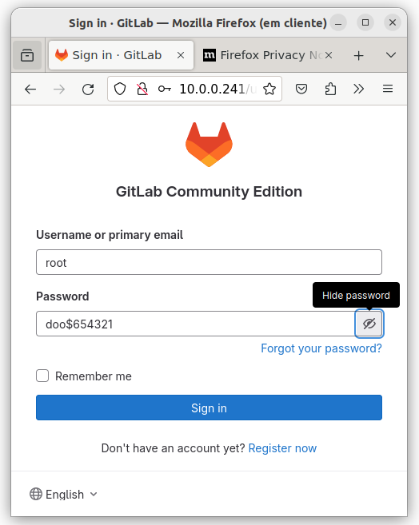

O próximo passo é criar um projeto no Gitlab, o nome do projeto será **firewall**


O próximo passo é criar um access token, no caminho [Projeto Webserver > Settings > Access Tokens](http://10.0.0.241/root/webserver/-/settings/access_tokens)
será utilizado as seguintes informações:
*   Token Name: firewall
*   Expiration date: vazio
*   Select a role: Maintainer
*   Select scopes: marcar todos

Obs: Lembrar de copiar o token e salvar.


O próximo passe é criar um Gitlab Runner no caminho [Admin Area > CI/CD > Runners](http://10.0.0.241/admin/runners)

Clicar no botão **New instance runner**
marcar a opção **Run untagged jobs**


Na próxima tela copiar o Token;


vamos abrir um terminal do container do runner, executando o comando `xterm runner` no prompt do ContainerNet,

com o terminal do runner aberto, execute o seguinte comando para registrar o Runner no Gitlab, substituir "__TOKEN__" pelo token gerado anteriormente:

```shell
gitlab-runner register --non-interactive --url http://10.0.0.241 --executor shell --token __TOKEN__ 
```


Verificar se o Runner esta online,


O próximo passo é acessar o DevOpsOrchestrator (DOO) em uma nova aba, no endereço: [http://10.0.0.243:8000](http://10.0.0.243:8000)
utilizar as seguintes credenciais:
*  Login: admin
*  Senha: admin

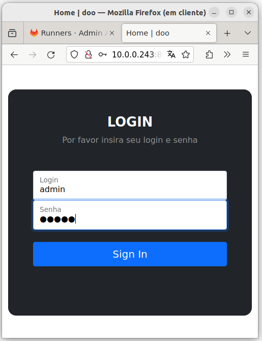

Clicar no menu [Repositorio](http://10.0.0.243:8000/repository/repo/)
clicar no botão **Adicionar**
utilizar as seguintes informações:

*  Nome: firewall
*  URL: http://10.0.0.241/root/firewall.git
*  Token: firewall
*  Token Key: __Access Token Gerado anteriormente__

Na próxima tela clicar no botão **IaC**,


O próximo passo é adicionar um inventario, clicando no botão **Add Host**,
vamos preencher com as seguintes informações:
* Host: 10.0.0.1
* Variables:
  *  ansible_user e clicar em "Adicionar";
  *  ansible_password e clicar em "Adicionar";
  *  ansible_become e clicar em "Adicionar";
  *  ansible_become_password e clicar em "Adicionar";
  *  ansible_ssh_common_args e clicar em "Adicionar";
  *  ansible_become_method e clicar em "Adicionar";
* ansible_user: ubuntu
* ansible_password: ubuntu
* ansible_become: true
* ansible_become_password: ubuntu
* ansible_ssh_common_args: -o StrictHostKeyChecking=no
* ansible_become_method: su

O próximo passo é adicionar o arquivo de configuração clicando no botão **Add File**,
preencher com as seguintes informações:
* Filename: main
* Name: Config Firewall e clicar em "Adicionar"

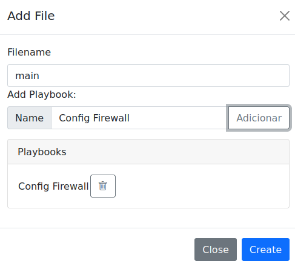

O próximo passo é clicar em **add Hosts** para associar o host a configuração,
selecione o IP 10.0.0.1,

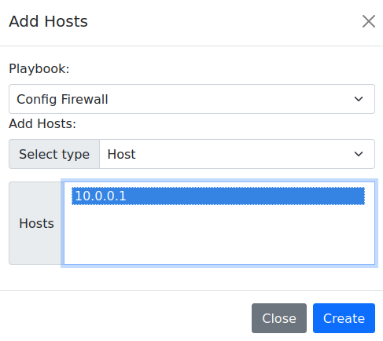

O próximo passo é clicar em **add Task**,
preencher com as seguintes informações:
*  Playbook: Config Firewall
*  Name: Ativar o encaminhamento de IP
*  Action: lineinfile
*  Option:
  *  line e clicar em "+"
preencher:
* line: net.ipv4.ip_forward=1
* path: /etc/sysctl.conf
  
Clicar me **+ Add Task**

O próximo passo é subir a tela e substituir os campos,
com as seguintes informações:

*  Playbook: Config Firewall
*  Name: Configurar NAT
*  Action: shell
*  Option:
  *  cmd e clicar em "+"
preencher:
* cmd: iptables -t nat -A POSTROUTING -o firewall-eth0 -j MASQUERADE
  
Clicar me **Add Task**

Clicar em **Close**

Entrar no Gitlab e ver a execução do pipeline no caminho [Projeto webserver > Build > Pipelines ](http://10.0.0.241/root/webserver/-/pipelines)

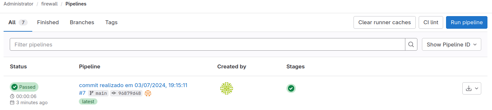

Entrar no pipeline e ver o script que foi executado,

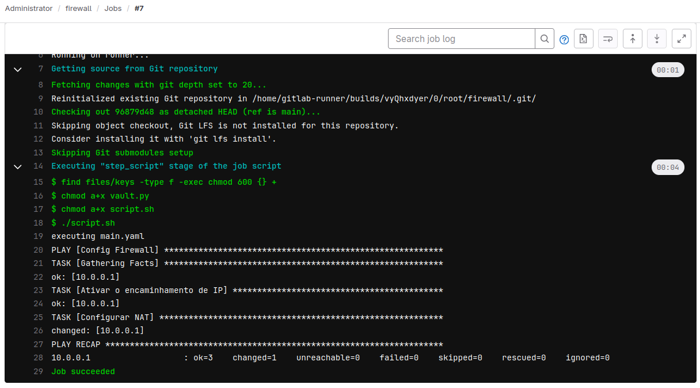

O próximo passo é mudar o gateway do cliente para o firewall, vamos fazer isso de forma manual,
para isso vamos chamar um terminal do cliente, no console do containernet vamos executar o comando ``xterm cliente``

para vermos a configuração do gateway, iremos executar o seguinte comando:

```Shell 
ip route show
```
depois vamos executar o comando ``ip route del default via 172.17.0.1`` para excluir a rota existente,

posteriormente executaremos ``ip route add default via 192.168.1.1`` para adicionar o gateway para o ip do firewall na rede 192.168.1.0

Para testar vamos pingar do cliente para uma maquina na rede 10.0.0.0, 
executando ``ping 10.0.0.243``.

os comandos executados podem ser visualizados abaixo:

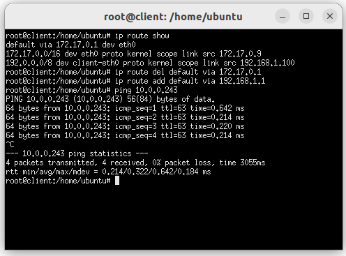

O próximo passo é criar o catalogo para adicionar os templates, voltamos para o DOO e vamos clicar em "Catalogo" no menu superior,

Nessa tela vamos clica em **+ Team** para adicionar uma nova equipe,

* Equipe: Redes e clicar em "Salvar";

Na tela de Catalogo vamos adicionar um grupo na equipe de Redes, clicando em **+ Group**

* Grupo: Segurança
* Equipe: Redes e clicar em "Salvar";

Na tela de Catalogo vamos adicionar um serviço no grupo de Infraestrutura, clicando em **+ Service**

* Serviço: Firewall
* Status: Ativo
* Grupo: Segurança e clicar em "Salvar";

O catalogo ficará com a seguinte estrutura:


O próximo passo é criar o template que irá fazer o bloqueio de porta no firewall, clicando em [Repositorio](http://10.0.0.243:8000/repository/repo/) e clicando em "IaC" no repositório Firewall, na próxima tela clicar em **Add Template**, preenche com os seguintes dados:

* Name: Bloquear Porta
* Filename: bloquear_porta
* Service: Firewall

Na tela de IaC vamos clicar em **Add Hosts** no template Bloquear Porta e selecionar o host 10.0.0.1 e clicar em "Add";

Na tela de IaC vamos clicar em **Add Task** no template Add Zona, aqui vamos adicionar a tarefa que irá bloquear a porta,
A tarefa vai executar um script iptables, para isso vamos selecionar a action "shell" e em options vamos preencher com as seguintes informações:

* Name: Bloquear porta se a porta estiver livre
* Action: shell
* Option:
  * cmd e clicar em "+"
preencher:
* cmd:
```bash
iptables -C FORWARD -p tcp --dport {{porta}} -j ACCEPT || iptables -A FORWARD -p tcp --dport {{porta}} -j DROP
```
Onde a variavel "{{porta}}" será solicitado no provisionamento.

click em ** + Add Task ** e depois em close.

Para liberar uma porta vamos criar um novo template, 
na tela de "IaC" clicar em **Add Template**, preenche com os seguintes dados:

* Name: Liberar Porta
* Filename: liberar_porta
* Service: Firewall

Na tela de IaC vamos clicar em **Add Hosts** no template Liberar Porta e selecionar o host 10.0.0.1 e clicar em "Add";

Na tela de IaC vamos clicar em **Add Task** no template Liberar Porta, aqui vamos adicionar a tarefa que irá liberar a porta,
A tarefa vai executar um script iptables, para isso vamos selecionar a action "shell" e em options vamos preencher com as seguintes informações:

* Name: Liberar Porta se a porta estiver bloqueada
* Action: shell
* Option:
  * cmd e clicar em "+"
preencher:
* cmd:
```bash
iptables -C FORWARD -p tcp --dport {{porta}} -j DROP && iptables -D FORWARD -p tcp --dport {{porta}} -j DROP
```
Onde a variavel "{{porta}}" será solicitado no provisionamento.

click em ** + Add Task ** e depois em close.

Vamos criar uma solicitação de mudança, acessando a opção [solicitações](http://10.0.0.243:8000/doo/ticket/) no menu superior, clicando no botão "adicionar" e preenchendo com as seguintes informações:

*  Numero: 123
*  Titulo: Bloquear Porta
*  Descrição: Solicito o bloqueio da porta 80 no Firewall.
*  Prioridade: media

Clicar em "Salvar"

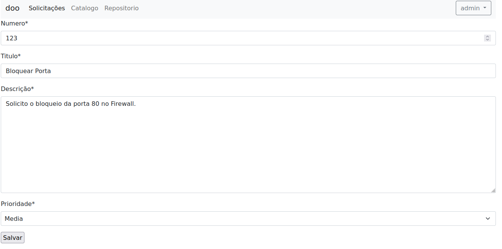

Com a solicitação criada podemos clicar no botão **provision**, na tela de provisão vamos preencher com as seguintes informações:

* Services: Firewall
* Templates: Bloquear Porta
* porta: 80

Antes de clicar em provision vamos fazer o seguinte teste, vamos no terminal do cliente e executar um comando telnet para o servidor do gitlab para ver o acesso,

execute o comando ``telnet 10.0.0.241 80`` com isso percebemos que o host esta acessivel na porta 80,

agora voltamos no DOO e vamos clicar em **provision**

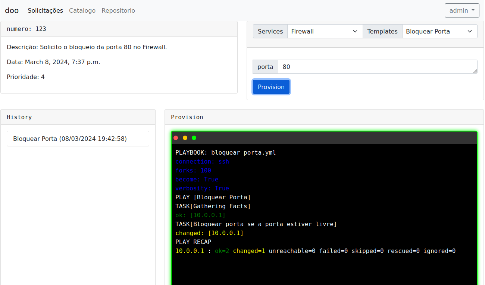

depois de executado voltamos para o terminal do cliente e executamos novamente o comando ``telnet 10.0.0.241 80`` e percebemos que o mesmo não tem acesso.

Para liberar o acesso vamos para o DOO e na tela de solicitação vamos escolher as seguinte opções:

* Services: Firewall
* Templates: Liberar Porta
* porta: 80

e clicamos em **Provision**

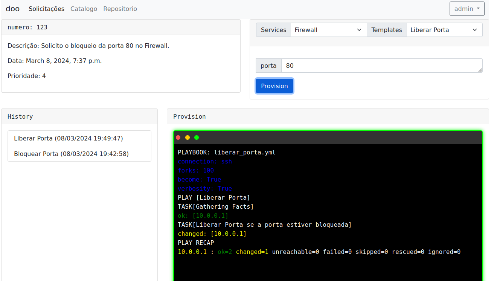

vamos para o terminal do cliente e executar novamente um ``telnet 10.0.0.241 80`` e percebemos que o acesso foi liberado.

as execuções do terminal do cliente pode ser vista abaixo:

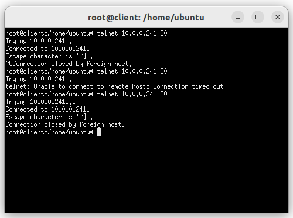

Para Bloquear/Desbloquear uma porta no Firewall basta utilizar os templates.


