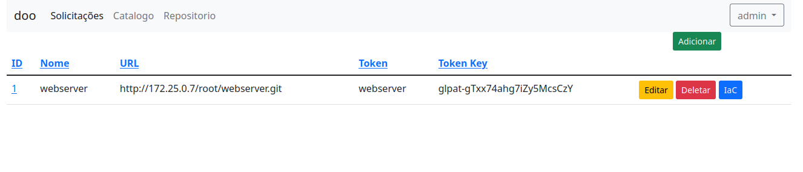
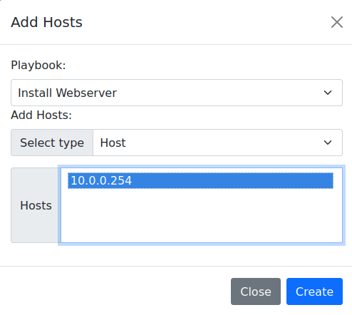
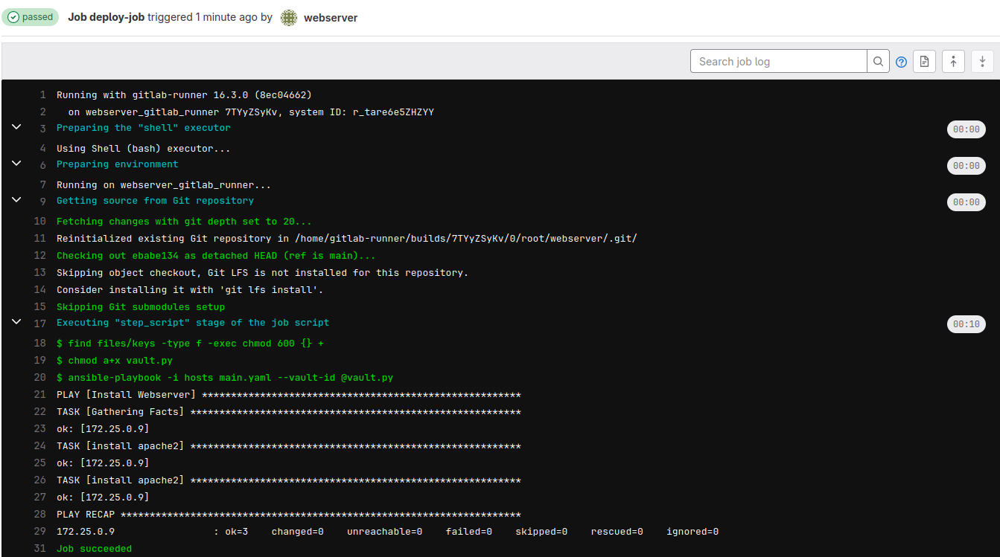

# Simulação de um Serviço de Firewall utilizando o Containernet

## Requisitos
A seguir estão as recomendações de hardware e software para executar a simulação.

### Hardware

|  **Properties**  	|         **Default Values**        	|
|:----------------:	|:---------------------------------:	|
| Operating System 	| Ubuntu Server 22.04.4 LTS 64 bits 	|
| Memory RAM       	| 5 GB                              	|
| CPU              	| 3 cores                           	|
| HD               	| 30 GB                             	|

### Software
*  Ubuntu 22.04.4
*  Python 3.11
*  Containernet 2.3.1b1

## Instalação dos requisitos

1. Instalando o Python:

```shell
sudo apt install python3.11
```

2. Instalando o containernet

```shell
$ git clone https://github.com/ramonfontes/containernet.git
$ cd containernet
$ sudo util/install.sh -W
```

## Topologia da rede


## Simulação no ContainerNet

### 1. Iniciando simulação

Depois de fazer checkout do código vamos entrar na pasta ``/DOO/docs/containernet/Firewall``

```shell
sudo python3 servico_web_containernet.py
```

Após a execução do código o prompt do ContainerNet será aprensentado,

Vamos abrir um terminal do container do Apache executando o comando `xterm apache1`,

com o terminal aberto vamos executar o comando `firefox`,


### 2. Acessando o Gitlab

Após a iniciação dos containers, que pode demorar um pouco, vamos acessar o Gitlab no endereço: [http://10.0.0.251](http://10.0.0.251) (atualize a pagina a cada 10s para ver se iniciou)
e utilizar as seguintes credenciais:
*  Usuario: root
*    Senha: doo$654321


#### 2.1 Criando Projeto

O próximo passo é criar um projeto no Gitlab, o nome do projeto será **webserver**


#### 2.2 Criando o Token

O próximo passo é criar um access token, no caminho [Projeto Webserver > Settings > Access Tokens](http://172.25.0.7/root/webserver/-/settings/access_tokens)
será utilizado as seguintes informações:
*   Token Name: webserver
*   Expiration date: vazio
*   Select a role: Maintainer
*   Select scopes: marcar todos

Obs: Lembrar de copiar o token e salvar.


#### 2.3 Configurando o Runner

O próximo passe é criar um Gitlab Runner no caminho [Admin Area > CI/CD > Runners](http://172.25.0.7/admin/runners)

Clicar no botão **New instance runner**
marcar a opção **Run untagged jobs**


Na próxima tela copiar o Token;


vamos abrir um terminal do container do runner, executando o comando `xterm runner` no prompt do ContainerNet,

com o terminal do runner aberto, execute o seguinte comando para registrar o Runner no Gitlab, substituir "__TOKEN__" pelo token gerado anteriormente:

```shell
gitlab-runner register --non-interactive --url http://10.0.0.251 --executor shell --token __TOKEN__ 
```


Verificar se o Runner esta online,


### 3. Acessando o DOO

O próximo passo é acessar o DevOpsOrchestrator (DOO) em uma nova aba, no endereço: [http://10.0.0.253:8000](http://10.0.0.253:8000)
utilizar as seguintes credenciais:
*  Login: admin
*  Senha: admin


#### 3.1 Criando Repositório no DOO

Clicar no menu [Repositorio](http://10.0.0.253:8000/repository/repo/)
clicar no botão **Adicionar**
utilizar as seguintes informações:

*  Nome: webserver
*  URL: http://10.0.0.251/root/webserver.git
*  Token: webserver
*  Token Key: __Access Token Gerado anteriormente__

Na próxima tela clicar no botão **IaC**,



#### 3.2 Adicionando Inventario

O próximo passo é adicionar um inventario, clicando no botão **Add Host**,
vamos preencher com as seguintes informações:
* Host: 10.0.0.254
* Variables:
  *  ansible_user e clicar em "Adicionar";
  *  ansible_password e clicar em "Adicionar";
  *  ansible_become e clicar em "Adicionar";
  *  ansible_become_password e clicar em "Adicionar";
  *  ansible_ssh_common_args e clicar em "Adicionar";
  *  ansible_become_method e clicar em "Adicionar";
* ansible_user: ubuntu
* ansible_password: ubuntu
* ansible_become: true
* ansible_become_password: ubuntu
* ansible_ssh_common_args: -o StrictHostKeyChecking=no
* ansible_become_method: su

#### 3.3 Adicionando Playbook

O próximo passo é adicionar o arquivo de configuração clicando no botão **Add File**,
preencher com as seguintes informações:
* Filename: main
* Name: Install Webserver e clicar em "Adicionar"


#### 3.4 Adicionando Host no Playbook

O próximo passo é clicar em **add Hosts** para associar o host a configuração,
selecione o IP 172.25.0.9,



#### 3.5 Adicionando Tarefas no Playbook

O próximo passo é clicar em **add Task**,
preencher com as seguintes informações:
*  Playbook: Install Webserver
*  Name: install apache2
*  Action: apt
*  Option:
  *  name e clicar em "+"
  *  state e clicar em "+"
  *  update_cache e clicar em "+"
preencher:
* name: apache2
* state: latest
* update_cache: checked

O próximo passo é clicar em **New Handler**
preencher com as seguintes informações:
*    Name: start apache
*  Action: sysvinit
*  Options:
  *  state e clicar em "+"
*  name: apache2
*  state: started


Selecionar **start apache** em Notify e clicar em "+",


Clicar me **Add Task**
Clicar em **Create**

### 4. Conferir Pipeline no Gitlab

Entrar no Gitlab e ver a execução do pipeline no caminho [Projeto webserver > Build > Pipelines ](http://172.25.0.7/root/webserver/-/pipelines)


Entrar no pipeline e ver o script que foi executado,



### 5. Acessar o servidor Web

Entrar em uma nova aba no caminho [http://10.0.0.254](http://10.0.0.254) e ver o servidor rodando.


## Video Explicativo

[](https://www.youtube.com/watch?v=jP_1qUE6Uco)


