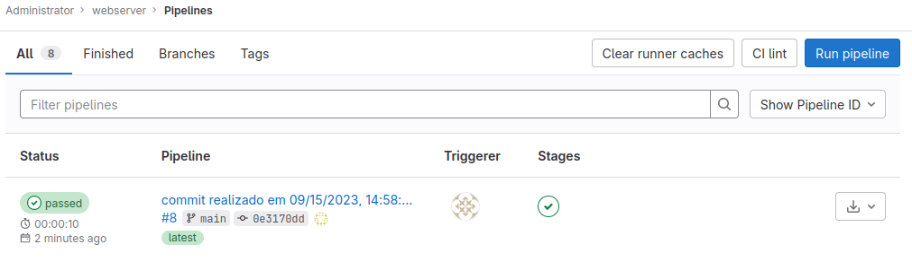

# Instalação de um webserver

## Requisitos
*  Ubuntu 22.04.4
*  Python 3.11

## Instalação dos requisitos

Instalando Python 3.11

```shell
sudo apt install python3.11
```

Para reproduzir o ambiente basta executar o seguinte comando nessa pasta:

```shell
docker compose up
```
Com isso será instanciada a seguinte topologia:


Após a iniciação dos containers vamos acessar o Gitlab no endereço: [http://172.25.0.7](http://172.25.0.7)
e utilizar as seguintes credenciais:
*  Usuario: root
*    Senha: 112233doo


O próximo passo é criar um projeto no Gitlab, o nome do projeto será **webserver**


O próximo passo é criar um access token, no caminho [Projeto Webserver > Settings > Access Tokens](http://172.25.0.7/root/webserver/-/settings/access_tokens)
será utilizado as seguintes informações:
*   Token Name: webserver
*   Expiration date: vazio
*   Select a role: Maintainer
*   Select scopes: marcar todos

Obs: Lembrar de copiar o token e salvar.


O próximo passe é criar um Gitlab Runner no caminho [Admin Area > CI/CD > Runners](http://172.25.0.7/admin/runners)

Clicar no botão **New instance runner**
marcar a opção **Run untagged jobs**


Na próxima tela copiar o Token;


Execute o seguinte comando para registrar o Runner no Gitlab, substituir "__TOKEN__" pelo token gerado anteriormente:

```shell
docker exec -it webserver_gitlab_runner gitlab-runner register --non-interactive --url http://172.25.0.7 --executor shell --token __TOKEN__ 
```
Verificar se o Runner esta online,


O próximo passo é acessar o DevOpsOrchestrator (DOO) no endereço: [http://172.25.0.6:8000](http://172.25.0.6:8000)
utilizar as seguintes credenciais:
*  Login: admin
*  Senha: admin


Clicar no menu [Repositorio](http://172.25.0.6:8000/repository/repo/)
clicar no botão **Adicionar**
utilizar as seguintes informações:

*  Nome: webserver
*  URL: http://172.25.0.7/root/webserver.git
*  Token: webserver
*  Token Key: __Access Token Gerado anteriormente__

Na próxima tela clicar no botão **IaC**,


O próximo passo é adicionar um inventario, clicando no botão **Add Host**,
vamos preencher com as seguintes informações:
* Host: 172.25.0.9
* Variables:
  *  ansible_user e clicar em "Adicionar";
  *  ansible_password e clicar em "Adicionar";
  *  ansible_become e clicar em "Adicionar";
  *  ansible_become_password e clicar em "Adicionar";
  *  ansible_ssh_common_args e clicar em "Adicionar";
  *  ansible_become_method e clicar em "Adicionar";
* ansible_user: ubuntu
* ansible_password: ubuntu
* ansible_become: true
* ansible_become_password: ubuntu
* ansible_ssh_common_args: -o StrictHostKeyChecking=no
* ansible_become_method: su

O próximo passo é adicionar o arquivo de configuração clicando no botão **Add File**,
preencher com as seguintes informações:
* Filename: main
* Name: Install Webserver e clicar em "Adicionar"


O próximo passo é clicar em **add Hosts** para associar o host a configuração,
selecione o IP 172.25.0.9,


O próximo passo é clicar em **add Task**,
preencher com as seguintes informações:
*  Playbook: Install Webserver
*  Name: install apache2
*  Action: apt
*  Option:
  *  name e clicar em "+"
  *  state e clicar em "+"
  *  update_cache e clicar em "+"

O próximo passo é clicar em **New Handler**
preencher com as seguintes informações:
*    Name: start apache
*  Action: sysvinit
*  Options:
  *  state e clicar em "+"
*  name: apache2
*  state: started


Selecionar **start apache** em Notify e clicar em "+",


Clicar me **Add Task**
Clicar em **Create**

Entrar no Gitlab e ver a execução do pipeline no caminho [Projeto webserver > Build > Pipelines ](http://172.25.0.7/root/webserver/-/pipelines)



Entrar no pipeline e ver o script que foi executado,


Entrar no caminho [http://172.25.0.9](http://172.25.0.9) e ver o servidor rodando.


